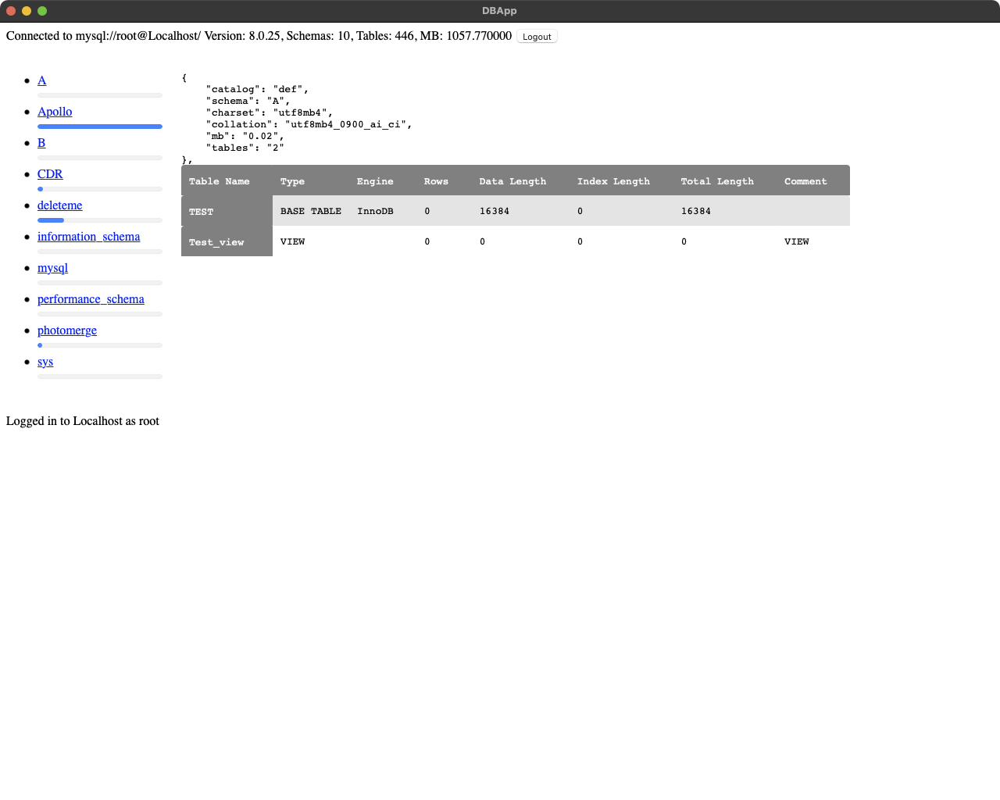

# DBApp
A database application that's super small and easy to develop. It really is small, as a Mac app it's 11MB and 500kb of that is the app and the rest is the MySQL support. Currently only supports MySQL (and therefore possibly MariaDB) and only shows database information at this stage.

# Screenshot

# Developer Notes
* Needs the brew installed mysql client library
* Statically compiles in mysql and associated libs for easy distribution to the great unwashed

# This App uses
* https://github.com/webview/webview as the framework to buiild the app with
* Borrowed the Mac menus idea from lukevers webview fork https://github.com/lukevers/webview
* https://github.com/tofsjonas/sortable to make HTML Tables sortable
* Borrowed the icon from DB Browser for SQLite ... for now, its so nice and simple

# Issues
* It's not even beta, it's alpha
* It's super unpretty
* There are probably lots of little bugs &amp; memory leaks to find and fix
* dodgy build.sh, untested on non-Mac

# ToDo
* codesigning &amp; a release
* Move the password storage to keychain on Mac
* Add the ability to run SQL and SQL documents
* etcetera ...