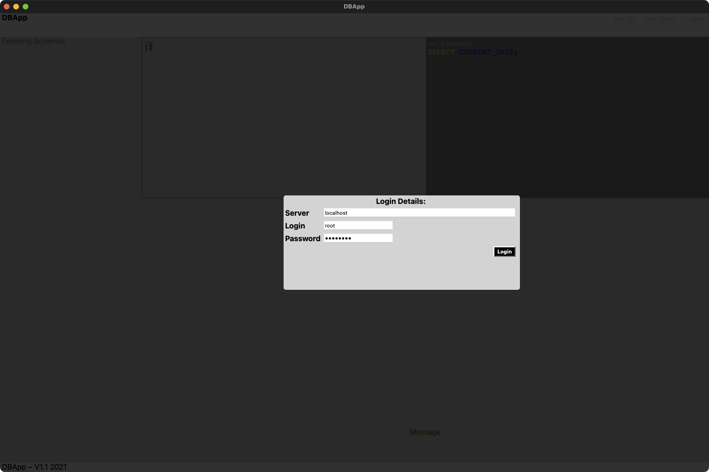

# DBApp
A database application that's super small and easy to develop. It really is small, as a Mac app it's 11MB and 500kb of that is the app and the rest is the MySQL support. Currently only supports MySQL (and therefore possibly MariaDB)

# Screenshots

# Developer Notes
* Needs the brew installed mysql client library
* Statically compiles in mysql and associated libs for easy distribution to the great unwashed
* Uses some basic encryption on the password and saves the configuration to ~/.DBApp.cnf as JSON
* Run build.sh to build and run

# This App uses
* https://github.com/webview/webview as the framework to buiild the app with
* Borrowed the Mac menus idea from lukevers webview fork https://github.com/lukevers/webview
* https://github.com/tofsjonas/sortable to make HTML Tables sortable
* Syntax highlighting supplied by https://prismjs.com (disabled for the moment) 
* Borrowed the icon from DB Browser for SQLite ... for now, its so nice and simple
* https://github.com/kueblc/LDT for Syntax highlighting

# Issues
* It's not even beta, it's alpha
* It's super unpretty
* There are probably lots of little bugs &amp; memory leaks to find and fix
* dodgy build.sh, untested on non-Mac

# ToDo
* codesigning &amp; a release
* Move the password storage to keychain on Mac
* Treeview the tables into the schema list
* etcetera ...