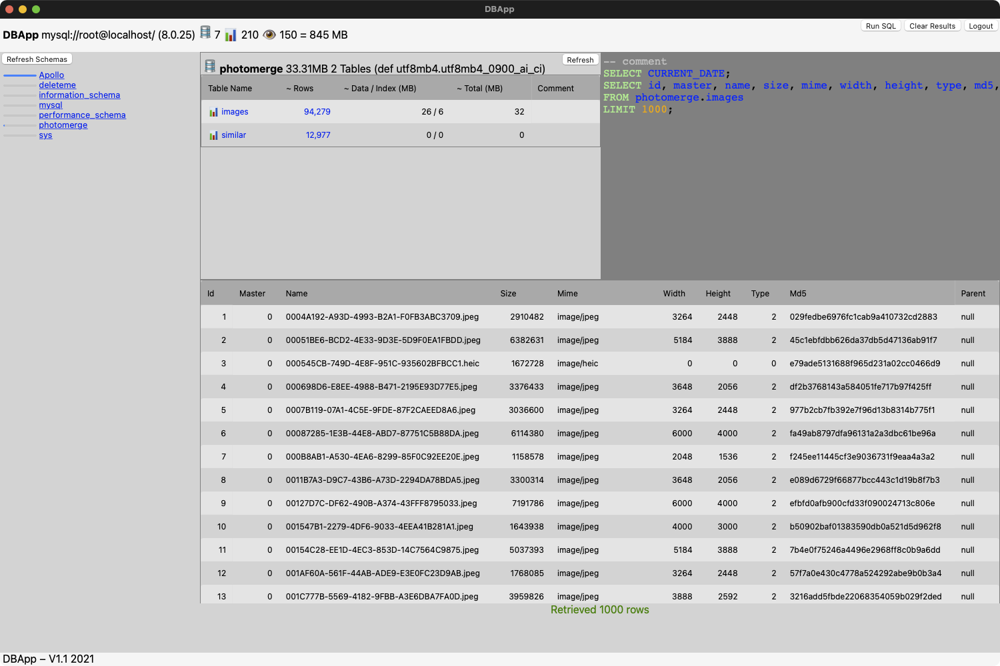

# DBApp
A database application that's super small and easy to develop. It really is small. Currently only shows database information

# Screenshot

# Developer Notes
* Needs the brew installed mysql client library
* Statically compiles in mysql and associated libs for easy distribution to the great unwashed

# This App uses
* https://github.com/webview/webview as the framework to buiild the app with
* Borrowed the Mac menus idea from lukevers webview fork https://github.com/lukevers/webview
* https://github.com/tofsjonas/sortable to make HTML Tables sortable
* Borrowed the icon from DB Browser for SQLite ... for now, its so nice and simple

# Issues
* It's not even beta, it's alpha
* Its super unpretty
* Need to make the c++ strings raw I think, the + sign blows things up
* There are lots of little bugs to find and fix, probably memory leaks etc.
* dodgy build.sh, untested on non Mac
* But hey, it works for me so far

# ToDo
* codesigning
* Add the ability to run SQL and SQL documents
* Many more than I could list